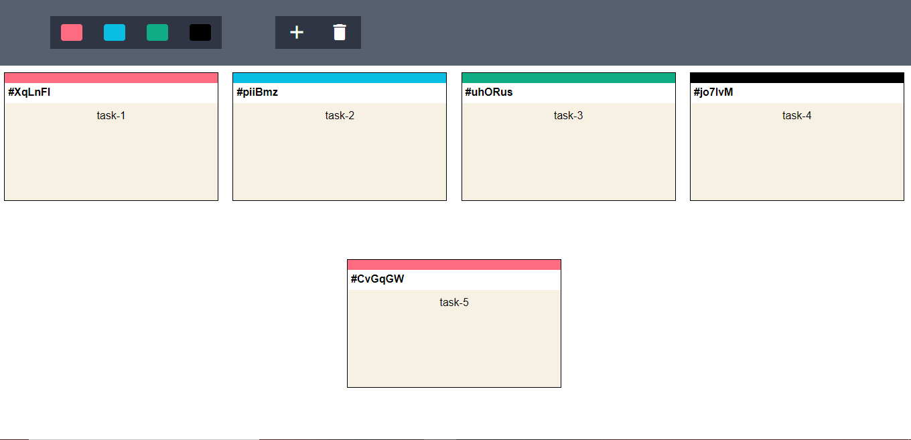
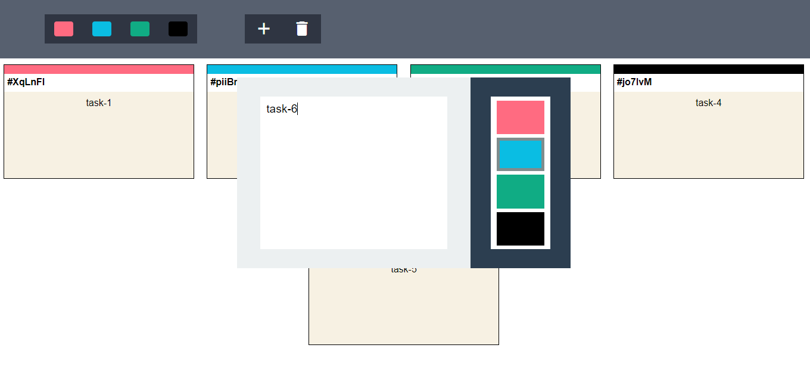
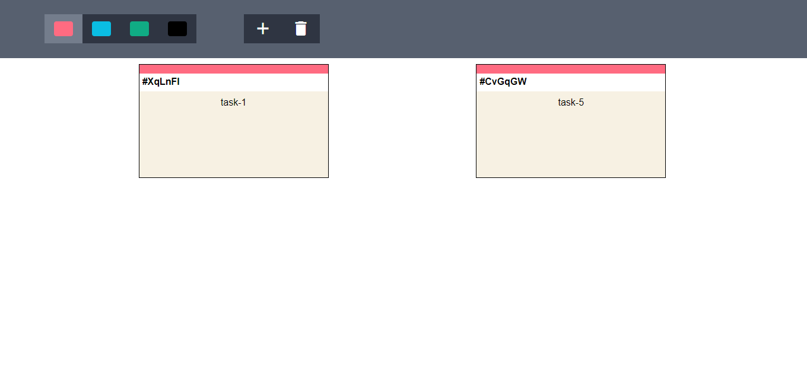

###  [Jira Task Management Tool](https://nikhil00shinde.github.io/Jira-Task-Mangement-Tool/)

* It's a task management tool. With help of this tool we can manage and set priority to our task in 4 different categories. This web tool also has local data persistence so that even if you close the app you'll still have the tasks managed.
***

***

***

***
